# HighAvailability-WebApp
High-Availability Multi-AZ Web Application Deployment on AWS using EC2, RDS, and Elastic Load Balancing

## Objective
Deploy a web application across multiple Availability Zones (AZs) to ensure **high availability, fault tolerance, and automated scaling** using AWS EC2, Auto Scaling, and an Elastic Load Balancing.

## Problem / Business Scenario
A growing e-commerce application must handle unpredictable traffic and ensure uninterrupted service. A single EC2 instance in one AZ is vulnerable to failure. The solution needed to:
- Distribute traffic across multiple AZs
- Automatically replace failed instances
- Scale to meet demand
- Allow secure, internet-accessible traffic

## Architecture Overview
**Services Used:** EC2, Auto Scaling Group, Elastic Load Balancing, Security Groups, Cloudfront, Cloudwatch, Relational Database Service (RDS)

**Architecture Diagram:**  
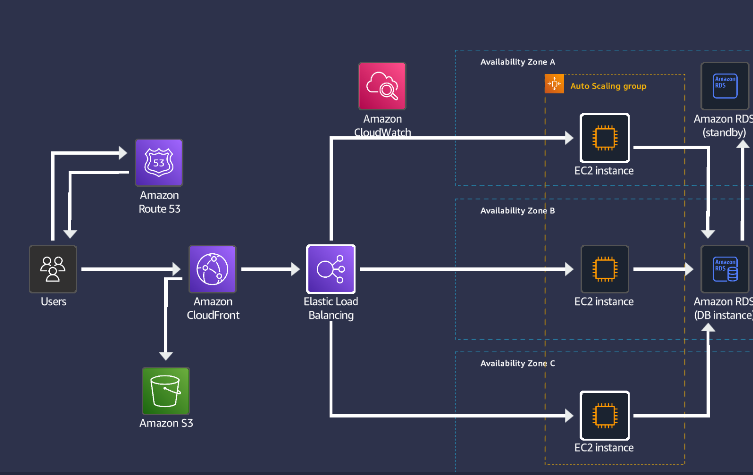

---

## Implementation Steps

### 1. Initial Setup
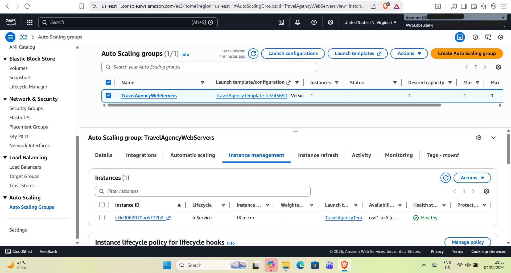  
*The Auto Scaling Group originally had one EC2 instance in a single Availability Zone.*

### 2. Create Target Group
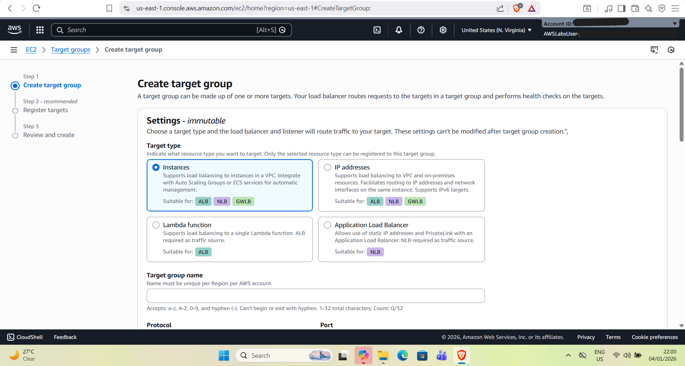  
*Created a Load Balancing target group with the target type set to "instances".*

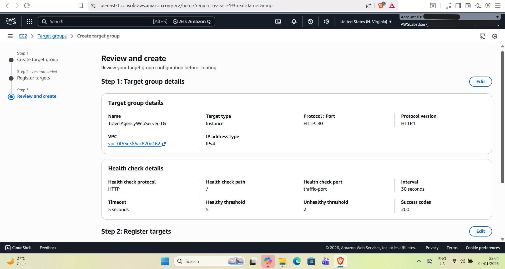  
*Reviewed and finalized the target group configuration.*

### 3. Setup Elastic Load Balancer
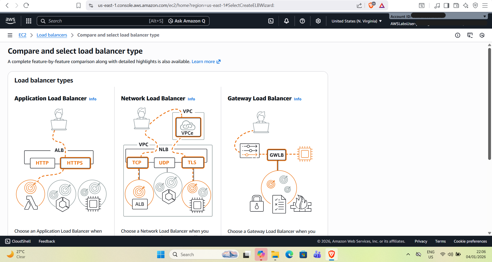  
*Created an Application Load Balancer to distribute incoming traffic.*

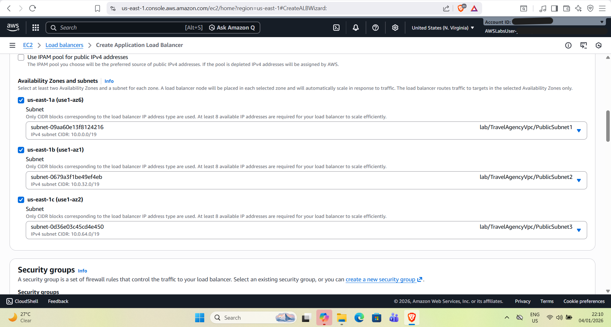  
*Selected 3 Availability Zones with public subnets for routing traffic.*

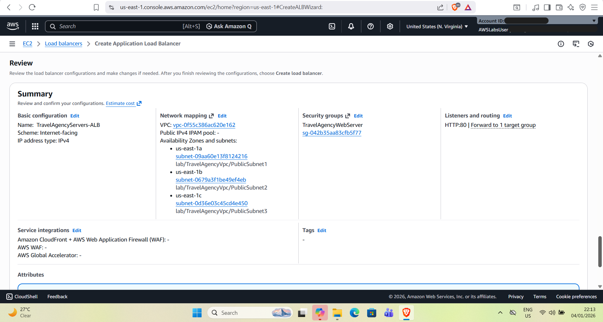  
*Final summary of the load balancer configuration.*

### 4. Integrate Target Group with ASG
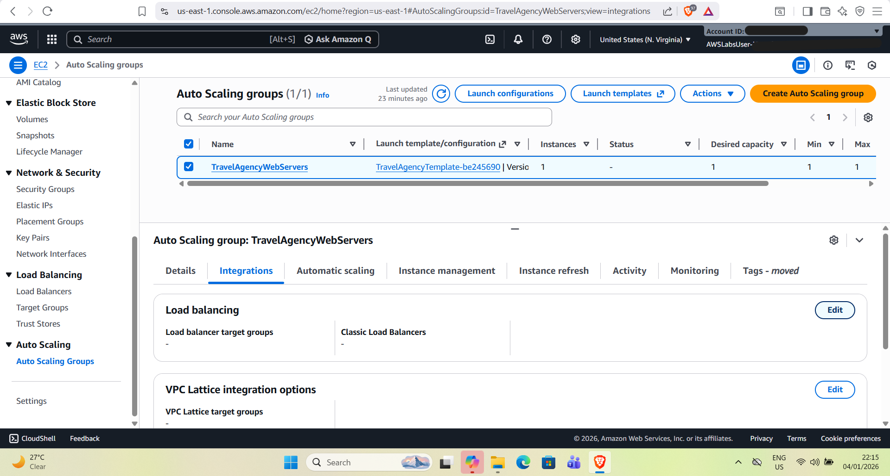  
*ASG before linking the target group.*

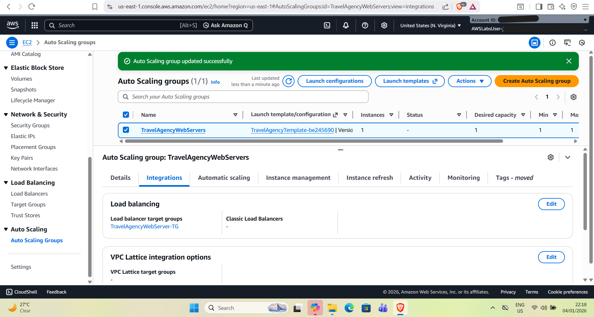  
*ASG now integrated with the target group; instances can receive traffic via the ALB.*

### 5. Configure Security Group
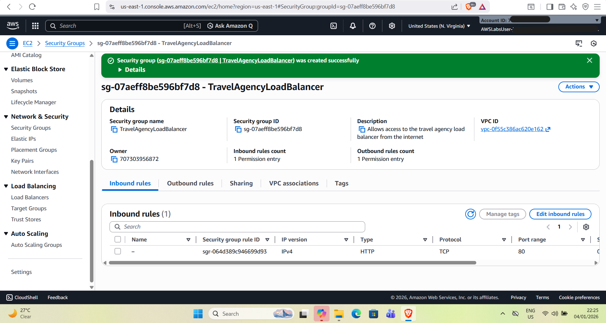  
*Security group created to allow inbound HTTP access from the internet.*

### 6. Simulate Failure & Auto-Recovery
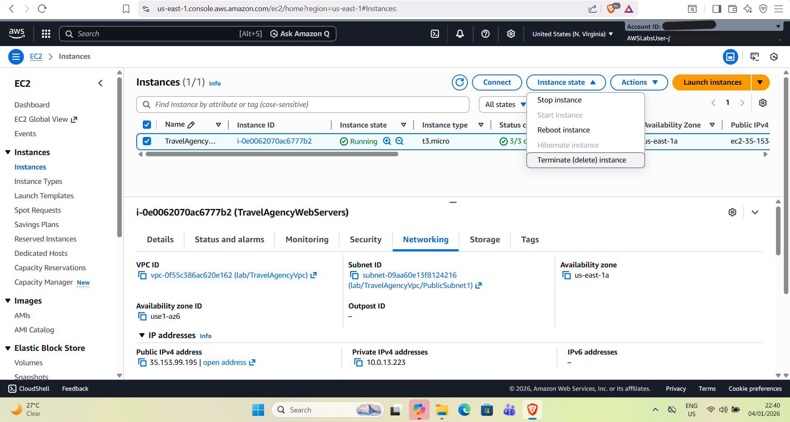  
*Terminated the original EC2 instance to simulate a failure scenario.*

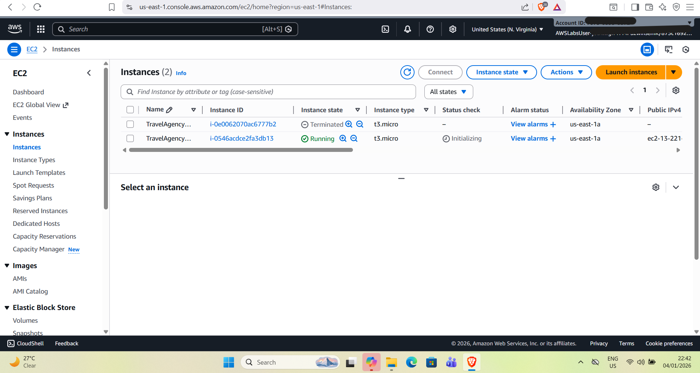  
*ASG automatically launched a new instance to maintain minimum capacity.*

[Watch auto-scaling video](media/VID12.mp4)  
*Video shows the automatic termination and launch of the new instance, simulating real-world fault tolerance.*

### 7. Scale Across Multiple AZs
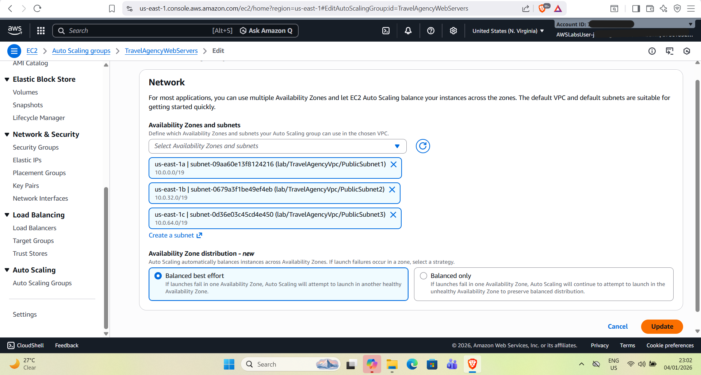  
*Added 2 more Availability Zones with public subnets to the ASG.*

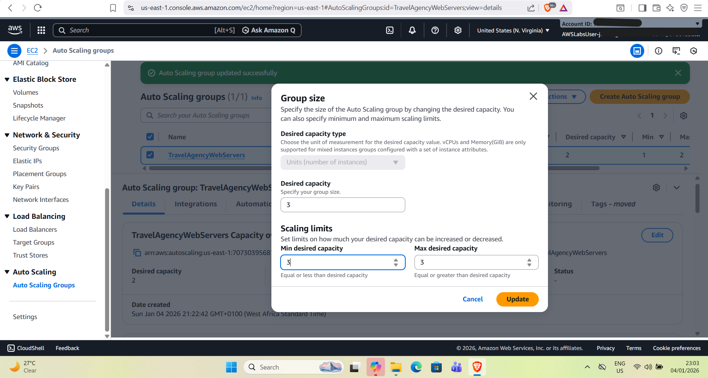  
*Updated desired, minimum, and maximum instance counts to 3.*

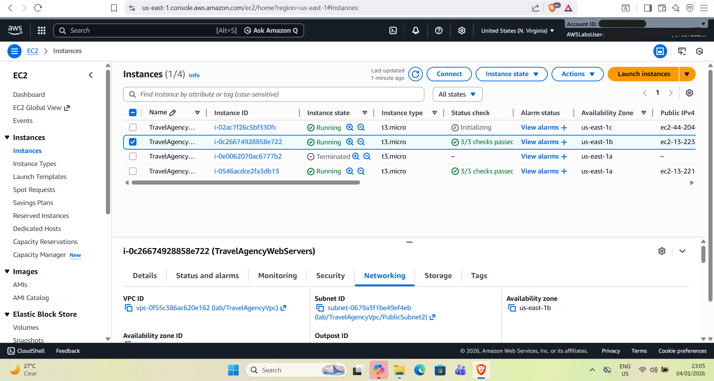  
*Verified 3 instances are running across 3 AZs, demonstrating high availability and fault tolerance.*

---

## Challenges & Key Decisions
- Choosing public subnets for ALB accessibility  
- Configuring ASG scaling policies (min, max, desired)  
- Simulating instance failures to demonstrate resilience  
- Applying least-privilege principle for security groups  

---

## Outcome / Results
- **High Availability:** Multi-AZ deployment reduces downtime risk  
- **Fault Tolerance:** ASG automatically replaces failed instances  
- **Scalability:** Can handle traffic spikes efficiently  
- **Real-World Simulation:** Demonstrated disaster recovery scenario  

---

## Lessons Learned / Takeaways
- Multi-AZ deployment is critical for production-level reliability  
- Auto Scaling ensures automated recovery and consistent performance  
- Security groups and subnet planning are key for safe internet access  
- Including screenshots & activity logs strengthens portfolio credibility
